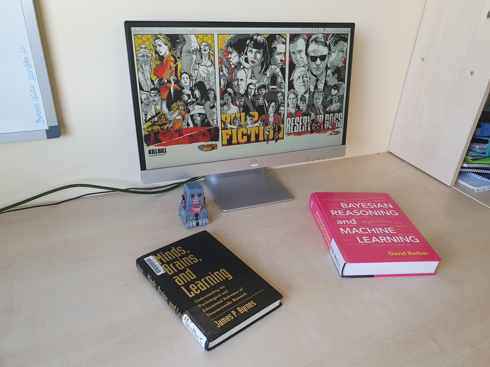
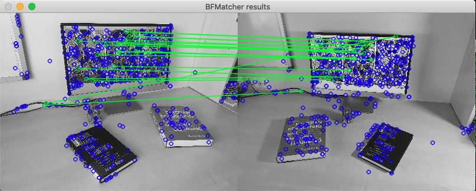
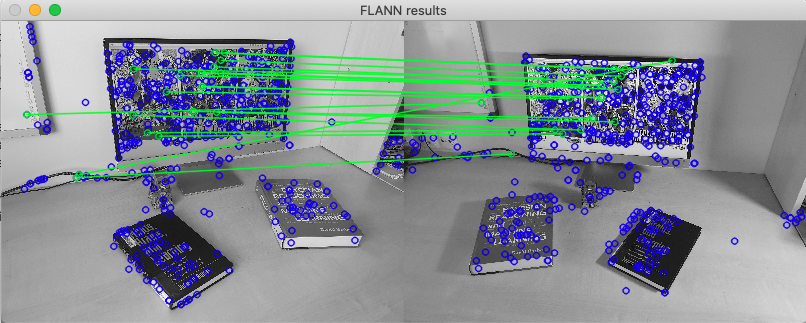

# SIFT feature matching using OpenCV

## Introduction
To exemplify the process of matching SIFT features coming from two frames of the same scenario, the following steps are coded:

1. Load two frames of a scene.
    - Images are converted to gray scale to ease computation
2. Computetion of Points Of Interest (PoIs) detection and description.
    - We compute PoI Detection using SIFT and PoI Description also using SIFT, alternatively we could choose a different method for PoI detection and PoI description respectively, such as SIFT, SURF, KAZE, Difference of Hessian, K.. for PoI detection, and SIFT, SURF, DSP-SIFT, KAZE... for PoI description.
3. Look for PoI matching in both frames [1][2].
    - We can use different methods that will be dependant on the PoI descriptor we use. For this example implementation we use two methods, a brute force approach using cv2.BFMatcher, and a nearest neighbour approach called FLANN, using cv2.FlannBasedMatcher. However, the state-of-the-art in feature matching offer more sophisticated approaches like the one in [2].

## Data
A here created dataset that consists of a moving camera around an office desktop that contains several objects such as a PC screen, and books, is used for the experiment.

  
Fig. 1. Sample frame of scene.  

### Results
SIFT Detector finds 505 PoI during our experiment (images converted to gray scale and downsampled to 10% of original spatial resolution).  

Using BFMatcher, and filtering using ratio test as in Lowe's paper (threshold = 0.7), we end up with 32 matches.  

On the other hand, using FLANN based matcher obtains 35 matches after the ratio test filter is applied.  

  
Fig. 1. Point correspondances using BFMatcher.  

  
Fig. 2. Point correspondances using FLANN matcher.  

## Cite this work
    J. Rico (2021) SIFT feature matching using OpenCV.
    [Source code](https://github.com/jvirico/sift-feature-matching)  

### References
[1] - [OpenCV Documentation. Feature Matching.](https://docs.opencv.org/4.5.2/dc/dc3/tutorial_py_matcher.html)  
[2] - Bian, Jia-Wang & Lin, wen-yan & Liu, Yun & Zhang, Le & Yeung, Sai-Kit & Cheng, Ming-Ming & Reid, Ian. (2020). GMS: Grid-Based Motion Statistics for Fast, Ultra-robust Feature Correspondence. International Journal of Computer Vision. 128. 10.1007/s11263-019-01280-3.  